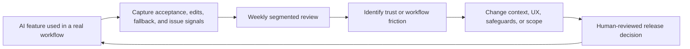

# Why Most AI Features Fail After Launch

## Context

AI features often have a generous launch week. A polished demonstration is easy to understand, early users are willing to experiment, and leadership has a concrete release to point to. None of that is false success. It is simply incomplete evidence.

The harder question arrives after the novelty settles: does the feature become part of a real workflow? For a product manager, the difference matters. A feature can generate clicks, positive comments in a launch thread, and an attractive demo while failing to reduce effort, improve decisions, or earn enough trust for repeat use.

This is particularly visible in B2B SaaS. Users are rarely trying to be impressed by an AI capability. They are trying to process an exception, approve a request, close a ticket, explain a variance, or prepare a customer response without creating additional risk. The product wins only when the AI feature fits that job reliably enough to change behavior.

## The Problem

Many AI features are launched around capability rather than adoption. The team proves that a model can summarize a case, draft a reply, recommend an action, or fill a form. That is useful for deciding whether a concept is worth testing. It is a poor definition of long-term product value.

A demo is forgiving. The input is selected carefully, the desired output is known, and a human presenter can quietly steer around weak responses. Daily work is not forgiving. Inputs are incomplete, customer language is inconsistent, permissions matter, policies have exceptions, and users need to understand when an answer should not be trusted.

Trust is not created by adding a confidence badge or stating that the user remains in control. Trust is accumulated through outcomes: the draft is usually relevant, corrections are easy, the system makes uncertainty visible, and mistakes do not impose more work than the original task. If a user has to verify every sentence in a generated response, the product may have moved effort rather than reduced it.

A useful distinction is **assistive AI** versus **autonomous AI**. Assistive AI helps a user prepare, summarize, compare, or decide. Autonomous AI acts, routes, sends, updates, or commits on the user's behalf. Autonomy can be valuable in constrained workflows, but teams often reach for it before they have measured whether assistance is accurate, trusted, and operationally manageable. In a high-consequence B2B workflow, a good draft with a clear approval step is often a better product than an automatic action with an unclear recovery path.

## Operational Reality

Consider an anonymized and simplified B2B SaaS scenario. A platform serving operations teams adds an AI-generated case summary to help account managers review service exceptions before contacting a customer. The summary feature launches well: many users open it during the first week, and internal reviewers like the clarity of demonstration examples. The example figures below are illustrative, not reported performance.

Four weeks later, usage is uneven. Senior account managers read the summaries but rewrite most of them because contract-specific commitments are missing. Newer users accept more text, but sometimes miss a required follow-up step because the summary presents the situation without the operational checklist. Some teams stop using it entirely after one visibly incorrect summary appears in a customer preparation meeting.

Nothing in this scenario means the idea was bad. It means the launch answered the wrong question. The product demonstrated text generation; the workflow required trusted preparation for a consequential action. A PM reviewing the feature would need to ask:

- Is the summary accepted with minor editing, or merely opened?
- Which missing context causes a rewrite or abandonment?
- Does use of the feature reduce preparation time without increasing correction risk?
- When the system is uncertain, does it decline gracefully, request missing data, or produce a confident but fragile response?

The fallback behavior is part of the product, not an engineering afterthought. For this workflow, a sensible fallback might be: display the known case facts, list missing context, and require the user to draft the recommendation manually. That may appear less impressive than generating an answer every time. Operationally, it is often more credible.

Post-launch feedback loops should therefore capture more than satisfaction. Product events can show where users edit, abandon, approve, or return to manual work. Customer-facing teams can report recurring failure modes. Structured review of low-quality outputs can identify whether the problem is missing context, poor prompt design, inadequate product rules, latency, or a use case that should remain human-led.

## Metrics That Matter

The measurement model should begin with behavior change, not output volume. A lightweight KPI tree for the summary feature might be:

```text
Trusted operational adoption
├── Reach and first use
│   ├── Eligible users exposed
│   └── First summary generated rate
├── Useful repeated behavior
│   ├── Summary accepted with minor edits
│   ├── Repeat use within 14 days
│   └── Preparation time change for reviewed cases
├── Friction and trust signals
│   ├── Heavy rewrite rate
│   ├── Summary abandonment rate
│   ├── Reported incorrect-output incidents
│   └── Manual fallback rate
└── Safety and operating quality
    ├── Missing-context detection rate
    ├── Escalations after AI-assisted preparation
    └── Reviewed output sample coverage
```

The primary metric should not be `summaries_generated`. A better candidate is **trusted repeat adoption**: eligible users who use the feature in more than one review period and accept the summary with only limited edits, divided by eligible users who attempted it. Even that metric needs guardrails. Fast acceptance is not a positive signal if users are approving incorrect content.

For the PM, the most revealing measures are often uncomfortable ones: heavy edits, manual fallback, issue reports, and differences between segments. These metrics do not make the feature look good or bad on their own; they make its operating conditions visible.

## Lightweight Artifact Section

A small adoption query can move the discussion away from launch impressions. The query below assumes synthetic events and PostgreSQL. It classifies users by whether a generated summary became repeated, lightly edited usage or stalled after experimentation.

```sql
WITH summary_activity AS (
    SELECT
        user_id,
        MIN(occurred_at) FILTER (WHERE event_name = 'summary_generated') AS first_use_at,
        COUNT(*) FILTER (WHERE event_name = 'summary_generated') AS generated_count,
        COUNT(*) FILTER (WHERE event_name = 'summary_accepted_minor_edit') AS accepted_minor_edit_count,
        COUNT(*) FILTER (WHERE event_name = 'summary_heavy_rewrite') AS heavy_rewrite_count,
        COUNT(*) FILTER (WHERE event_name = 'manual_fallback_selected') AS fallback_count,
        COUNT(DISTINCT DATE_TRUNC('week', occurred_at))
            FILTER (WHERE event_name = 'summary_accepted_minor_edit') AS accepted_weeks
    FROM product_events
    WHERE occurred_at >= CURRENT_DATE - INTERVAL '28 days'
      AND event_name IN (
          'summary_generated',
          'summary_accepted_minor_edit',
          'summary_heavy_rewrite',
          'manual_fallback_selected'
      )
    GROUP BY user_id
)
SELECT
    CASE
        WHEN accepted_minor_edit_count >= 2 AND accepted_weeks >= 2 THEN 'trusted_repeat_use'
        WHEN heavy_rewrite_count > accepted_minor_edit_count THEN 'high_correction_friction'
        WHEN fallback_count > 0 THEN 'fallback_required'
        WHEN generated_count > 0 THEN 'trial_only'
        ELSE 'not_used'
    END AS adoption_state,
    COUNT(*) AS users
FROM summary_activity
GROUP BY adoption_state
ORDER BY users DESC;
```

The operating loop can remain simple:



This loop is less glamorous than a launch dashboard. It is also much closer to how adoption is earned.

## Tradeoffs

An assistive product can feel conservative compared with an autonomous one. It asks for confirmation, exposes uncertainty, and sometimes refuses to finish a task. Those are not necessarily weaknesses. They are trade-offs in favor of control, diagnosis, and recoverability while the product is still learning what dependable value looks like.

There is an opposing risk: too many warnings and review steps can eliminate the time savings that justified the feature. PM work here is not to insist on maximum caution or maximum automation. It is to determine where errors become costly, where users need control, and where evidence supports reducing friction safely.

Practical takeaways:

1. Define adoption as a repeated valuable behavior before launch, not after engagement disappoints.
2. Treat editing, abandonment, and fallback events as first-class product instrumentation.
3. Review trust by workflow and segment; an AI feature may work for one role and fail for another.
4. Begin with assistive behavior when context is incomplete or mistakes have external consequences.
5. Make fallback useful: preserve known facts, show missing context, and provide a clean manual path.
6. Use demonstrations to generate hypotheses, not to declare product success.

## Final Thoughts

Most AI features do not fail after launch because the underlying technology is useless. They fail because the product team optimizes the visible moment of generation and underinvests in the quieter work of adoption: context, trust, correction, fallback, instrumentation, and operational ownership.

A durable AI product does not need to astonish users every time it runs. It needs to help them complete real work with fewer avoidable decisions and fewer costly surprises. That standard is harder to demonstrate in a launch meeting, but it is the standard that eventually matters.
