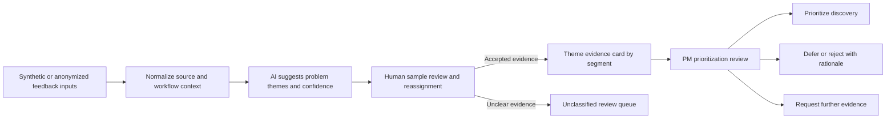

# Workflow: Feedback To Accountable Decision

## Operating Notes

- Raw customer text is not required in a public artifact; synthetic or anonymized summaries are sufficient for demonstrating the workflow.
- AI output remains inspectable through confidence, source coverage, and reassignment tracking.
- A human product owner records the decision and its constraints before any roadmap treatment.
