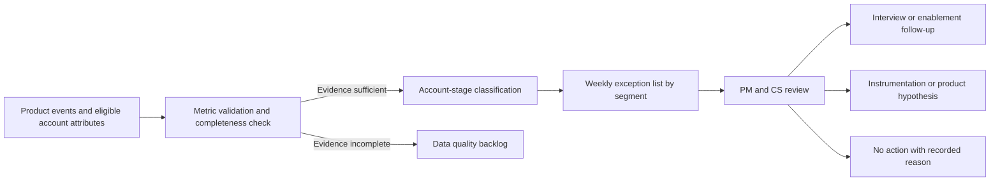

# Workflow: Adoption Exception Review

## Operating Notes

- The workflow produces review candidates, not automatic customer actions.
- Data-quality findings enter their own backlog rather than being interpreted as failed adoption.
- Review outcomes should inform the false-positive metric and the next revision of classification rules.
